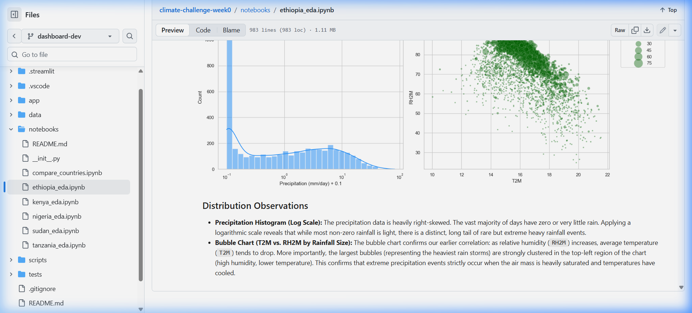

# Climate Challenge: Week 0 - African Climate EDA

This repository contains the environment setup, data preprocessing, and exploratory data analysis (EDA) for the 10 Academy Climate Challenge. The goal of this project is to analyze climate trends across five African nations (Ethiopia, Kenya, Sudan, Tanzania, and Nigeria) to generate negotiation-grade insights for the upcoming COP32 climate reporting project.

## 🌟 Project Implementation & Contributions

Our implementation successfully processed raw NASA POWER climate datasets through a structured pipeline:

1. **Robust Environment Setup (Task 1)**: 
   - Initialized a standardized data science folder structure.
   - Established an isolated Python virtual environment (`venv`).
   - Configured `.gitignore` to keep raw and clean CSV datasets out of version control for security and efficiency.
   - Implemented a CI/CD pipeline via GitHub Actions to automatically verify the environment integrity on push.

2. **Data Cleaning & Profiling (Task 2)**: 
   - Handled NASA's `-999.0` sentinel missing values properly by converting them to `NaN`.
   - Forward-filled isolated missing values and dropped duplicates.
   - Profiled statistical outliers (Z-score > 3) and strategically retained them, recognizing that extreme weather spikes represent genuine climate anomalies essential for COP32 analysis.

3. **Exploratory Data Analysis (EDA)**: 
   - **Time Series**: Identified distinct wet/dry seasons and hottest/coolest months across 2015–2026.
   - **Correlation**: Highlighted highly correlated variables (e.g., negative correlation between temperature and relative humidity).
   - **Distributions**: Used logarithmic scaling on precipitation histograms and plotted 3D bubble charts to map heavy storm events to humidity and temperature thresholds.

4. **Automated Pipeline Generation**:
   - Engineered a custom Python automation script to use Ethiopia's notebook as a master template.
   - Dynamically generated identical, executed EDA notebooks for Kenya, Sudan, Tanzania, and Nigeria with stripped Python comments and precise, dynamically-calculated markdown statistics.

5. **Cross-Country Comparison & Vulnerability Ranking (Task 3)**:
   - **Synthesis**: Integrated cleaned datasets from all five nations into a unified analysis framework.
   - **Statistical Testing**: Conducted One-Way ANOVA and Kruskal-Wallis tests to mathematically prove significant climate divergence across regions (p << 0.05).
   - **Extreme Event Profiling**: Quantified annual frequencies of extreme heat (>35°C) and consecutive dry days to identify "climate hotspots."
   - **Vulnerability Index**: Developed a weighted composite ranking system based on heat stress, rainfall instability, and drought exposure to inform COP32 policy recommendations.

6. **Bonus: Interactive Climate Dashboard**:
   - **Live Link**: [🚀 Access the COP32 Intelligence Portal](https://climate-challenge-week0-ncygexxzr4gh25wp5dtedc.streamlit.app/)
   - **Interactive Visualization**: Built a premium Streamlit application with zoomable Plotly charts.
   - **Dynamic Controls**: Implemented multi-country selection, year range sliders, and variable toggles.
   - **Intelligence Metrics**: Added real-time risk scoring and a data export center for policy briefs.
   - **Cloud Fallback**: Engineered a sample data pipeline to ensure the app functions on public cloud platforms.

   
   *Figure: Preview of the Interactive Intelligence Portal featuring 3D atmospheric discovery.*

## 📂 Repository Structure

```
├── .github/workflows/   # Continuous Integration (CI) actions
├── app/                 # Streamlit dashboard application
│   ├── sample_data/     # Lightweight data for cloud deployment
│   ├── main.py          # Dashboard entry point
│   └── utils.py         # Visualization and logic utilities
├── data/                # Climate datasets (Ignored by Git)
│   ├── raw/             # Original NASA POWER datasets
│   ├── processed/       # Cleaned datasets for analysis
│   └── images/          # Exported visualization plots
├── notebooks/           # Jupyter notebooks for EDA
│   ├── ethiopia_eda.ipynb  
│   ├── kenya_eda.ipynb     
│   ├── nigeria_eda.ipynb   
│   ├── sudan_eda.ipynb     
│   ├── tanzania_eda.ipynb  
│   └── compare_countries.ipynb # Cross-country synthesis
├── scripts/             # Python automation and utility scripts
├── tests/               # Unit tests for data pipeline
├── requirements.txt     # Project dependencies
├── final_report.md      # Comprehensive project summary report
└── README.md            # Project documentation
```

## 📁 Folder Guide

| Folder / File | Purpose |
|---|---|
| `.github/workflows/` | CI/CD pipeline — auto-installs dependencies and verifies imports on every push to any branch |
| `data/` | Raw NASA POWER CSVs and cleaned outputs — **excluded from Git** (see `.gitignore`) |
| `notebooks/` | Per-country Jupyter EDA notebooks + `compare_countries.ipynb` for cross-country analysis |
| `scripts/` | Shared Python helper module (`eda_utils.py`) used across all country notebooks |
| `tests/` | Unit tests for utility functions to ensure data pipeline correctness |
| `app/` | Streamlit interactive dashboard (Bonus Task) |
| `requirements.txt` | Pinned project dependencies — used by CI and local setup |
| `final_report.md` | Full project summary report covering methodology, KPIs, and COP32 findings |
| `.gitignore` | Excludes `data/`, `venv/`, `.ipynb_checkpoints/`, and other artifacts from version control |

## 🌿 Branch Strategy

| Branch | Purpose |
|---|---|
| `setup-task` | Base environment setup — `.gitignore`, `requirements.txt`, CI workflow |
| `eda-ethiopia` | Ethiopia climate EDA (master documented template) |
| `eda-kenya` | Kenya climate EDA |
| `eda-sudan` | Sudan climate EDA |
| `eda-tanzania` | Tanzania climate EDA |
| `eda-nigeria` | Nigeria climate EDA |
| `compare-countries` | Cross-country vulnerability ranking and COP32 analysis |
| `dashboard-dev` | Streamlit interactive dashboard (Bonus Task) |

## 🛠️ Reproducing the Environment

To reproduce this environment and run the analyses locally, follow these steps:

1. **Clone the repository:**
   ```bash
   git clone https://github.com/Afomiat/climate-challenge-week0.git
   cd climate-challenge-week0
   ```

2. **Create a Python Virtual Environment:**
   Run the following command to create an isolated Python environment named `venv`:
   ```bash
   python -m venv venv
   ```

3. **Activate the Virtual Environment:**
   - **Windows:**
     ```powershell
     .\venv\Scripts\activate
     ```
   - **Mac/Linux:**
     ```bash
     source venv/bin/activate
     ```

4. **Install Dependencies:**
   With the virtual environment activated, install the required packages using:
   ```bash
   pip install -r requirements.txt
   ```
