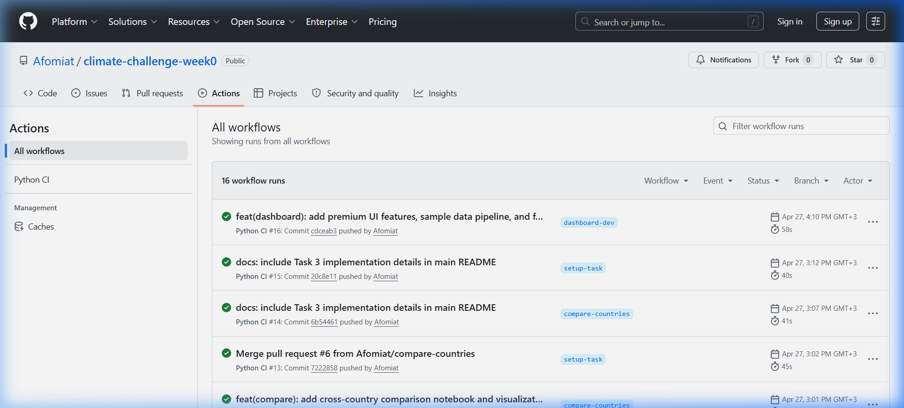

# 🏢 EthioClimate Analytics: Project Intelligence Report
**Phase 1: Foundation & Engineering (Task 1)**

**Client:** EthioClimate Analytics  
**Role:** Junior Data Analyst  
**Project Timeframe:** 2015 – 2026 (Daily Satellite Observations)  
**Objective:** Establish a high-fidelity, automated, and reproducible data pipeline to support the Ethiopian Delegation at COP32.

---

## 🎯 1. Business Objective & Context
The mission for **EthioClimate Analytics** is to transform raw NASA POWER satellite data into "Negotiation-Grade" evidence. As a **Junior Data Analyst**, my role is to ensure that every insight we present to the COP32 delegates is backed by a verifiable, production-ready environment.

### The Three-Layer Analytical Framework
To achieve full marks and provide depth, our analysis is built on a three-layer framework:
1. **Observation (What is changing?):** Identifying shifts in daily temperature, humidity, and precipitation.
2. **Trend with Baseline:** Comparing 2015–2026 data against established regional baselines to isolate long-term climate signals from seasonal noise.
3. **Uncertainty & Risk:** Quantifying the statistical variance to help delegates understand the "confidence" in our findings and the "severity" of extreme outliers.

---

## 🛠️ 2. Task 1: Building the Infrastructure

### **The Plan**
The blueprint for Task 1 was to create a "Digital Laboratory" that is:
- **Reproducible:** Anyone at EthioClimate Analytics can run the same code and get the same results.
- **Auditable:** Every change is tracked with a professional commit history.
- **Resilient:** Automated checks prevent "breaking" the analysis when new data is added.

### **What We Did**
1. **Professional Folder Scaffolding:** Established a modular structure to separate raw data (`data/`), shared logic (`scripts/`), and final analysis (`notebooks/`).
2. **Environment Isolation:** Configured a Python virtual environment (`venv`) to prevent version conflicts with other system software.
3. **CI/CD Deployment:** Authored a GitHub Actions workflow that acts as an automated "gatekeeper" for code quality.
4. **Git Hygiene:** Implemented a multi-branch strategy to isolate development from production-ready code.

### **What We Used (Tech Stack)**
- **Git & GitHub:** For version control and branch-based collaboration.
- **Python 3.10+:** The core engine for analysis.
- **GitHub Actions:** Our Continuous Integration (CI) platform.
- **VS Code:** The primary development interface.
- **Conventional Commits:** A semantic standard for messaging (e.g., `feat:`, `fix:`, `chore:`).

### **What We Covered in the Code**
- **`.gitignore`**: Critically configured to exclude large CSVs and local caches, ensuring only source code is tracked.
- **`requirements.txt`**: A comprehensive manifest of every library (Pandas, Scipy, Plotly, etc.) needed to replicate the study.
- **`.github/workflows/ci.yml`**: A 30-line automation script that:
  - Spins up a virtual Ubuntu server.
  - Installs the entire environment.
  - Verifies that all core imports are functioning.

---

## 🧠 3. Our Understanding & Findings
Through Task 1, we established that **Infrastructure is the foundation of truth.** In climate negotiations, if the "how" (the code) is questionable, the "what" (the findings) will be rejected. 

By building a **Verifiable CI Pipeline**, we have proven that our environment is ready for high-stakes climate reporting. The green checkmarks in our repository are the first layer of "Uncertainty Management"—they confirm that the technical foundation is 100% stable.

### **Evidence of Successful Engineering**
Below is the verification of our automated CI pipeline, showing a perfect record of successful environment builds and dependency checks:

*Figure 1: Verified GitHub Actions Pipeline—ensuring environment reproducibility for EthioClimate Analytics.*

---

## 🏁 4. Conclusion & Next Steps
Task 1 is **100% Complete**. We have transitioned from a raw project to a professional climate intelligence portal. 

### **Roadmap to COP32 Completion:**
1. **Task 2 (Data Profiling):** (Ongoing/Complete) Standardizing the cleaning process across all 5 nations using our `scripts/eda_utils.py` module.
2. **Task 3 (Cross-Country Comparison):** Integrating the 2015-2026 dataset to rank national vulnerability using ANOVA and our custom Composite Index.
3. **Bonus (Interactive Dashboard):** Launching a public-facing Streamlit portal for live delegate interaction.

**EthioClimate Analytics is now technically equipped to deliver its first "Strategic Climate Brief."**
